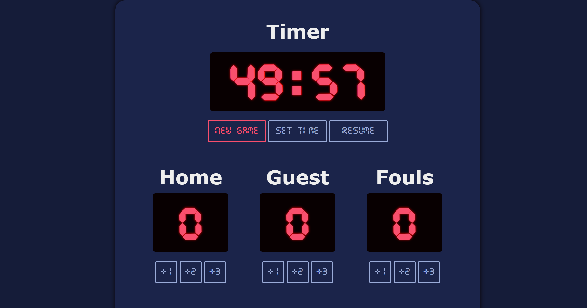

# scrimba-score-board
  

Completed application for Solo Project 2 (Score Board) of the Scrimba Full Stack Developer course. The site represents a sports game with default counters (Home, Guest, Fouls, Period) alongside the abiility to create new counters. This assignment appears after learning basic HTML, CSS, and JavaScript syntax. The course allows for students to practice implementing designs based on Figma files, with hosting done on Vercel and Netlify.

  
Project Screenshots

  
  

## Project Requirements
### Main Requirements
- Create a project based on the provided Figma design file ✅
- Create counters for the Home and Guest teams with the ability the shown increment buttons ✅
### Bonus Requirements
- Add a "New Game" Button ✅
- Highlight the leader ✅
- Add a few more counters (period, fouls, timer) ✅
- Change the design ✅
### Additional Requirements
These are added features outside of the project requirements and additional challenges.
- Ability to create new panels (dynamically)
- Ability to remove new panels.
- Ability to set a custom time (seconds)

Full Stack Developer course available through Scrimba: https://scrimba.com/.

